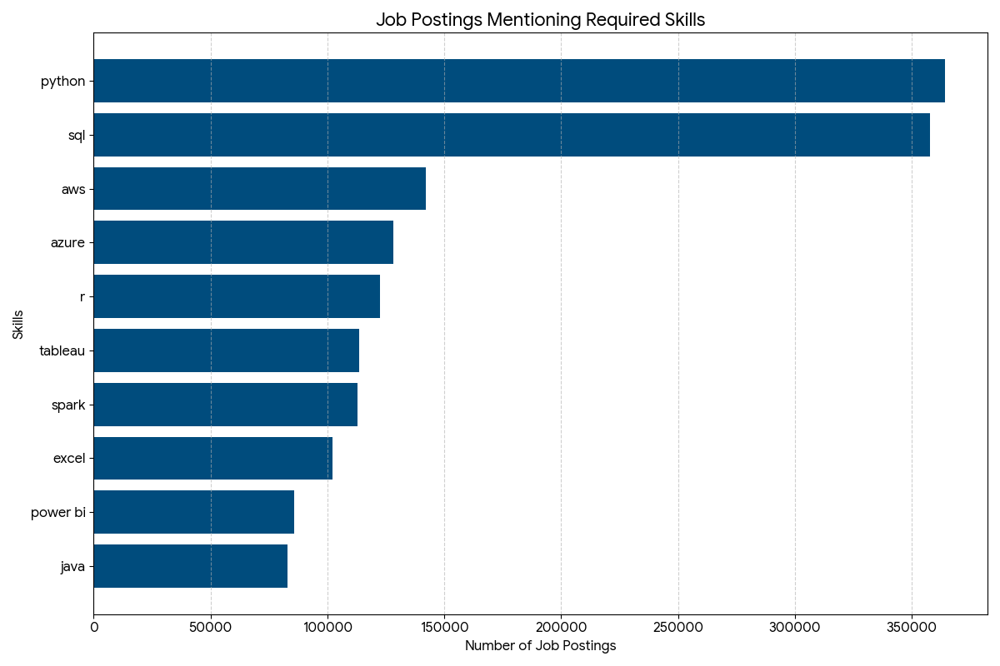

# 📊 Top Paying Data Jobs & Skills
**Thinking about your next career move in data?**

This repository is a strategic guide to navigating the high-paying world of data jobs. It's not just a collection of SQL queries—it's a hands-on toolkit for data professionals. Inside, you'll find five practical SQL analyses that demystify the job market and provide a clear blueprint for success.

Each query is saved in its own file, complete with the original SQL, a breakdown of its purpose, and concise, actionable insights derived directly from the results. Dive in to discover which skills are in demand, what roles offer the best compensation, and how you can leverage data analysis to advance your career. 🚀

## Key SQL Queries & Insights

### 01_top_paying_jobs.sql 🔎

```sql
/*
Purpose:
What are the top-paying jobs focusing on data?
— Identify the top 10 highest—paying roles that are available remotely.
— Focuses on job postings with specified salaries (remove nulls).

Why?
Highlight the top—paying opportunities, offering insights into the demand for data-focused roles.
*/

SELECT
    job_postings_fact.job_id,
    job_postings_fact.job_title_short,
    job_postings_fact.job_title,
    company_dim.name AS company_name,
    ROUND(job_postings_fact.salary_year_avg, 0) AS salary_year_avg,
    job_postings_fact.job_work_from_home

FROM job_postings_fact
LEFT JOIN company_dim
    ON job_postings_fact.company_id = company_dim.company_id
WHERE
    job_postings_fact.salary_year_avg IS NOT NULL
    AND
    job_postings_fact.job_work_from_home = 'Yes'
    AND
    (LOWER(job_postings_fact.job_title_short) LIKE '%data%'
    OR LOWER(job_postings_fact.job_title_short) LIKE '%analy%'
    OR LOWER(job_postings_fact.job_title_short) LIKE '%engineer%')
ORDER BY
    job_postings_fact.salary_year_avg DESC
LIMIT 10;
```
**💡 Key insight:** This query surfaces the highest-paying remote roles in the data domain. These roles tend to be senior, specialized, and often tied to engineering or advanced analytics responsibilities. Use this to target high-paying remote roles and study their required skills and companies.


### 02_top_paying_jobs_skills.sql 🧰
```sql
/*
Purpose:
What skills are required for the top—paying data focused jobs?
- Add the specific skills required for these roles

Why?
It provides a detailed look at which high—paying jobs demand certain skills, helping job seekers understand which skills to develop that align with top salaries
*/

WITH top_paying_jobs AS (
    SELECT
        job_postings_fact.job_id,
        job_postings_fact.job_title_short,
        job_postings_fact.job_title,
        company_dim.name AS company_name,
        job_postings_fact.salary_year_avg,
        job_postings_fact.job_work_from_home

    FROM job_postings_fact
    LEFT JOIN company_dim
        ON job_postings_fact.company_id = company_dim.company_id
    WHERE
        job_postings_fact.salary_year_avg IS NOT NULL
        AND
        job_postings_fact.job_work_from_home = 'Yes'
        AND
        (LOWER(job_postings_fact.job_title_short) LIKE '%data%'
        OR LOWER(job_postings_fact.job_title_short) LIKE '%analy%'
        OR LOWER(job_postings_fact.job_title_short) LIKE '%engineer%')
    ORDER BY
        job_postings_fact.salary_year_avg DESC
    LIMIT 10
)

SELECT
    top_paying_jobs.*,
    skills.skills
FROM top_paying_jobs
INNER JOIN skills_job_dim AS skills_to_job
    ON top_paying_jobs.job_id = skills_to_job.job_id
INNER JOIN skills_dim AS skills
    ON skills_to_job.skill_id = skills.skill_id
```
**💡 Key insight:** High‑paying remote roles commonly require a mix of advanced engineering skills, cloud/database experience, and ML/AI tooling. The query helps prioritize which skills to highlight when targeting top salary brackets.


### 03_top_demanded_skills.sql 📈
```sql
/*
Purpose: What are the most in—demand skills for data focused jobs?
- Identify the top in-demand skills.
- Focus on all job postings.

Why?
Retrieves the top 10 skills with the highest demand in providing insights into the most valuable skills for job seekers.
*/

SELECT
    skills.skills,
    COUNT(*) AS demand_count
FROM job_postings_fact
INNER JOIN skills_job_dim AS skills_to_job
    ON job_postings_fact.job_id = skills_to_job.job_id
INNER JOIN skills_dim AS skills
    ON skills_to_job.skill_id = skills.skill_id
WHERE
--    job_location = 'Anywhere'
--    AND 
    (
        LOWER(job_postings_fact.job_title) LIKE '%data%'
        OR LOWER(job_postings_fact.job_title) LIKE '%engineer%'
        )
GROUP BY
    skills.skills
ORDER BY
    demand_count DESC
LIMIT 10;
```



**💡 Key insights:**
The results of this query reveal a critical distinction between foundational skills and specialized ones. While our previous analysis of top‑paying jobs highlighted the importance of a wide range of advanced tools, this broader view across all data‑focused job postings underscores a clear message:

- The highest demand is for fundamental, versatile skills. Python and SQL are overwhelmingly the two most sought-after skills, with demand counts that are more than double that of any other skill.
- Cloud computing skills (AWS and Azure) and visualization tools (Tableau and Power BI) show high demand.

This data suggests that mastering the basics is the most reliable path to entry and growth in the data job market.


### 04_top_avg_salary_perSkill.sql 💵
```sql
/*
Purpose: What are the top skills based on salary?
- Look at the average salary associated with each skill for data related positions
- Focuses on roles with specified salaries, regardless of location

Why?
It reveals how different skills impact salary levels for data related roles and helps identify the most financially rewarding skills to acquire or improve
*/

SELECT
    skills.skills,
    ROUND(AVG(job_postings_fact.salary_year_avg), 0) AS avg_salary
FROM job_postings_fact
INNER JOIN skills_job_dim AS skills_to_job
    ON job_postings_fact.job_id = skills_to_job.job_id
INNER JOIN skills_dim AS skills
    ON skills_to_job.skill_id = skills.skill_id
WHERE
--    job_location = 'Anywhere'
--    AND 
    salary_year_avg IS NOT NULL
    AND
    (
        LOWER(job_postings_fact.job_title) LIKE '%data%'
        OR LOWER(job_postings_fact.job_title) LIKE '%engineer%'
        )
GROUP BY
    skills.skills
ORDER BY
    avg_salary DESC
LIMIT 20;
```


**💡 Key insights:**
- Specialization commands a premium: Highest-paying skills are often niche and specialized (deep learning frameworks, niche databases, and platform-specific tools).
- AI/ML expertise (PyTorch, Hugging Face, Theano) correlates with higher salaries.
- Specialized databases (Mongo, Cassandra, Neo4j) and full‑stack/backend skills (Node, Scala, ASP.NET Core) also appear high on the salary list.

This means: combine strong fundamentals with a specialized skill to maximize salary potential.


### 05_top_optimal_skills.sql 🎯
```sql
/*
Purpose: What are the most optimal skills to learn (aka it's in high demand and a high—paying skill)?
— Identify skills in high demand and associated with high average salaries for interested roles
— Concentrates on remote positions with specified salaries

Why?
Targets skills that offer job security (high demand) and financial benefits (high salaries), offering strategic insights for career development in interested fields
*/

SELECT
    skills.skills,
    ROUND(AVG(job_postings_fact.salary_year_avg), 0) AS avg_salary,
    COUNT(job_postings_fact.job_id) AS job_count
FROM job_postings_fact
INNER JOIN skills_job_dim AS skills_to_job
    ON job_postings_fact.job_id = skills_to_job.job_id
INNER JOIN skills_dim AS skills
    ON skills_to_job.skill_id = skills.skill_id
WHERE
--    job_location = 'Anywhere'
--    AND
    salary_year_avg IS NOT NULL
    AND
    (
        LOWER(job_postings_fact.job_title) LIKE '%data%'
        OR LOWER(job_postings_fact.job_title) LIKE '%engineer%'
    )
GROUP BY
    skills.skills
HAVING
    COUNT(job_postings_fact.job_id) > 100
ORDER BY
    avg_salary DESC,
    job_count DESC
LIMIT 20;

```


**💡 Key insights:**
- Big Data is a high-value field: Spark, Kafka, and Hadoop show strong job counts and salaries.
- Cloud-native infra matters: Snowflake, Redshift, and Kubernetes are important skills for modern data platforms.
- ML tooling and frameworks (PyTorch, TensorFlow, Scikit-learn) remain high-value skills.
- Non-relational DB expertise (Mongo, Cassandra, Neo4j) is valuable for specific data models.
- Integration skills (Airflow, Kafka) are crucial for end-to-end pipeline work.


## 🛠️ Technologies Used
- SQL (PostgreSQL compatible syntax)
- VS Code (editor)
- Git & GitHub (version control and hosting)

## 📚 Data Source
Data provided by Luke Barousse as part of his Advanced SQL course. Source files and dataset were taken from:
[Google Drive Link](https://drive.google.com/drive/folders/1moeWYoUtUklJO6NJdWo9OV8zWjRn0rjN)

Attribution: Luke Barousse — [YouTube Profile](https://www.youtube.com/@LukeBarousse)

___


